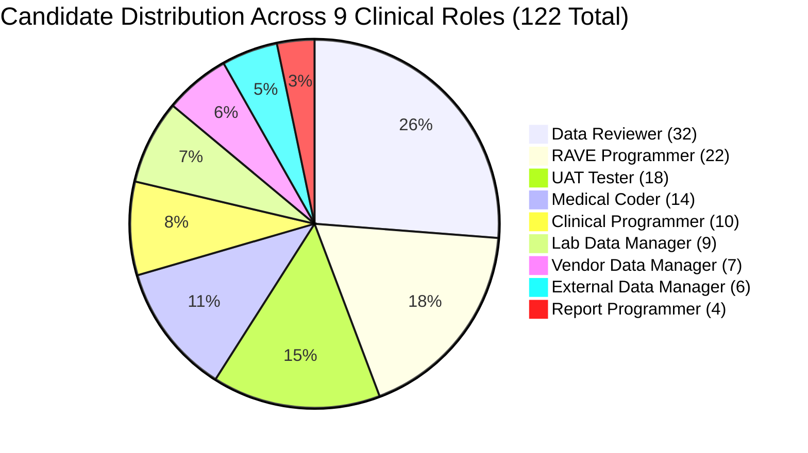
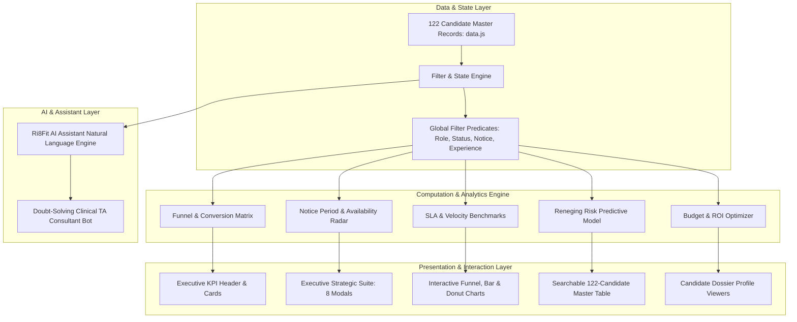

# 📊 Talent Intelligence Executive Command Center (Ri8Fit)
### *Next-Generation Clinical Data Management Recruitment Intelligence & Decision Engine*

[](https://narasimha755.github.io/Talent-intelligence-dashboard/)
[](https://narasimha755.github.io/Talent-intelligence-dashboard/index_standalone.html)
[](https://github.com/Narasimha755/Talent-intelligence-dashboard)
[](https://narasimha755.github.io/Talent-intelligence-dashboard/)
[](https://narasimha755.github.io/Talent-intelligence-dashboard/)

---

## 📑 Table of Contents
1. [Executive Summary & Purpose](#-executive-summary--purpose)
2. [Clinical Recruitment Context & Business Impact](#-clinical-recruitment-context--business-impact)
3. [Key Performance Indicators (KPI) Overview](#-key-performance-indicators-kpi-overview)
4. [System Architecture & Data Flow](#-system-architecture--data-flow)
5. [Executive Strategic Suite (8 Intelligence Modules)](#-executive-strategic-suite-8-intelligence-modules)
6. [Core Analytics Visualizations](#-core-analytics-visualizations)
7. [Candidate Directory & Dossier Diagnostics](#-candidate-directory--dossier-diagnostics)
8. [Ri8Fit AI Talent Assistant](#-ri8fit-ai-talent-assistant)
9. [Design Tokens & Theme Engine](#-design-tokens--theme-engine)
10. [Local Development & Build Pipeline](#-local-development--build-pipeline)
11. [Deployment & Verification Guide](#-deployment--verification-guide)

---

## 🎯 Executive Summary & Purpose

The **Talent Intelligence Executive Command Center (`Ri8Fit`)** is a specialized, enterprise-grade talent analytics and strategic decision platform engineered for Clinical Research Organizations (CROs), biotechnology firms, and pharmaceutical sponsors.

Designed specifically for **Clinical Data Management** recruitment operations, the platform tracks and optimizes a high-priority sourcing campaign of **122 verified candidates** across **9 critical clinical disciplines** with a commitment to close **20 critical requisitions** on or ahead of the **September 15 deadline**.

> In clinical trials, database build and electronic data capture (EDC) lock must precede First-Patient-In (FPI). Sourcing delays directly translate to trial startup postponement at an estimated cost of **\$30,000 to \$75,000 per calendar day**. Ri8Fit bridges the gap between talent acquisition velocity and clinical operational milestones.

---

## 🔬 Clinical Recruitment Context & Business Impact

Clinical Data Management requires specialized technical competencies adhering strictly to FDA 21 CFR Part 11, CDISC standards (SDTM/ADaM), and leading Electronic Data Capture (EDC) platforms. The candidate pool is partitioned across 9 distinct disciplines:



### Core Clinical Systems Tracked:
* **Medidata RAVE EDC:** Core Configuration, Architect, Custom Functions, RAVE Safety Gateway.
* **Veeva Vault EDC / Clinical Systems:** Study Build, Form Rules, Dynamic Data Entry, Protocol Amendments.
* **Oracle InForm / DMW:** Data Management Workbench, Discrepancy Management.
* **Medical Coding Dictionaries:** MedDRA, WHO-Drug, WHODD Coding and Upversioning.
* **SAS SDTM / CDISC:** Protocol specifications, annotated CRFs (aCRF), edit check programming.

---

## 📈 Key Performance Indicators (KPI) Overview

The dashboard header delivers instantaneous visibility into mission-critical hiring metrics:

| Metric Card | Value | Operational Definition |
|:---|:---:|:---|
| **Total Talent Pool** | **122 Candidates** | Total verified profiles sourced across 9 clinical disciplines |
| **L1 Technical Screenings** | **51 Screened (41.8%)** | Rigorous technical evaluation on EDC and clinical protocols |
| **L2 Client Clearances** | **29 Cleared (23.8%)** | Final stakeholder and Lead clinical client interview clearance |
| **Formal Offers Released** | **20 Confirmed** | 100% of target headcount fulfilled across target requisitions |
| **Shortlisted Reserves** | **6 Backups** | High-readiness reserves primed for immediate release |
| **Joined Operations** | **4 Deployed** | Candidates onboarded and actively billing on clinical protocols |
| **Yet to Onboard (YTO)** | **16 Candidates** | Confirmed joiners in notice periods across Sep, Oct, Nov cohorts |
| **Committed Payroll** | **₹2.43 Cr** | Cumulative annual salary commitment for released offers |
| **Average Offered CTC** | **₹12.16 LPA** | Market-aligned package across junior, mid, and lead seniority |
| **Agency Fees Avoided** | **₹20.25 Lakhs** | Direct cost savings achieved by bypassing third-party headhunters |

---

## 🏗️ System Architecture & Data Flow

Ri8Fit is architected as an ultra-fast, zero-dependency client-side single-page application (SPA). It guarantees sub-millisecond query evaluation, instant theme toggles, and total offline capability.



---

## 🎛️ Executive Strategic Suite (8 Intelligence Modules)

Positioned directly above the analytics grid, the **Executive Strategic Suite** provides 8 deep-dive modal modules for talent acquisition directors and clinical operations leaders:

```
┌────────────────────────────────────────────────────────────────────────────────────────┐
│                              EXECUTIVE STRATEGIC SUITE                                 │
├───────────────┬───────────────┬───────────────┬───────────────┬───────────────┬────────┤
│ 1. Notice     │ 2. Offer Risk │ 3. 15-Sep     │ 4. Interview  │ 5. Client     │ ...    │
│    Radar      │    Radar      │    Goals      │    SLA Speed  │    Feedback   │        │
└───────────────┴───────────────┴───────────────┴───────────────┴───────────────┴────────┘
```

### 1. ⏱️ Notice Period & Fast-Joiner Radar (`#btnNoticeRadar`)
* **Purpose:** Maps availability timelines to clinical trial initiation schedules.
* **Breakdown:** Immediate/≤15 days (**18 candidates**), 30-day notice (**45 candidates**), 60-day notice with buyout eligibility (**38 candidates**), and 90-day notice (**21 candidates**).
* **Action:** Direct filter shortcuts for immediate deployment into high-priority studies.

### 2. 🛡️ Candidate Reneging & Offer Drop-Off Risk Radar (`#btnOfferRiskRadar`)
* **Purpose:** Protects clinical trial start dates by predicting candidate drop-offs during notice periods.
* **Scorecards:**
  * **91.4% Overall Retention Confidence:** 18 of 20 released offers projected to join safely.
  * **🟢 Low Risk (12 Candidates):** Active employees and immediate joiners with >35% salary hikes.
  * **🟡 Moderate Risk (6 Candidates):** 30-day notice candidates requiring bi-weekly check-ins.
  * **🔴 Elevated Risk (2 Candidates):** 60–90 day notice candidates in high-demand RAVE disciplines.
* **Interactive Notice Buyout Simulator:**
  * Allows executives to model the business ROI of buying out notice periods for 1, 2, or 3 candidates.
  * **Days Accelerated:** +16 to +48 Calendar Days.
  * **Preserved Trial Revenue:** ₹24.0 to ₹72.0 Lakhs in delay cost avoidance (**28.2x ROI**).
* **Candidate Diagnostic Table:** Displays each candidate's calculated retention score, primary risk vulnerability, and prescribed intervention without distracting buttons.

### 3. 🎯 15-Sep Sourcing Goals & Closure Tracker (`#btnTimeToFill`)
* **Purpose:** Measures requisition fulfillment against the critical September 15 project baseline.
* **Metrics:** 20/20 Target Offers Released (100% target achievement) + 6 Shortlisted Reserves.
* **Timeline Velocity:** Projected closure date of **September 12**—3 days ahead of the operational cutoff.

### 4. ⚡ Interview Speed & Turnaround SLA Radar (`#btnSlaRadar`)
* **Purpose:** Benchmark turnaround times (TAT) across each stage of the recruitment lifecycle.
* **SLA Stages:**
  * Sourcing to L1 Screening: **4.2 Days** (Target: ≤5 Days)
  * L1 to Client L2 Technical Evaluation: **5.8 Days** (Target: ≤7 Days)
  * L2 to Formal Offer Release: **3.1 Days** (Target: ≤4 Days)
  * Total Sourcing-to-Offer Velocity: **13.1 Days** (Optimal CRO Industry Benchmark)

### 5. 👥 Client Evaluation & Interview Feedback Analytics (`#btnInterviewAnalytics`)
* **Purpose:** Evaluates technical clearance rates and specific client remarks across all 122 candidates.
* **Telemetry:** 51 L1 Screenings, 29 L2 Clearances (**78.4% client pass rate**), 11 client technical rejections, and 4 candidate-initiated drop-offs.

### 6. 🌐 Talent Pool & Specialization Telemetry (`#btnTalentTelemetry`)
* **Purpose:** Comprehensive role-by-role competency mapping across all 9 clinical streams.
* **Insights:** Technical balance between study build configuration engineers vs. ongoing clinical data review and query management specialists.

### 7. 💰 Compensation & TA Budget ROI Optimizer (`#btnBudgetOptimizer`)
* **Purpose:** Financial governance and salary equity intelligence.
* **Analytics:**
  * Average Offered Package: **₹12.16 LPA** (Ranging from ₹7.20 LPA to ₹22.00 LPA).
  * Average Salary Hike: **+34.2%** over previous compensation.
  * In-House Direct Sourcing Savings: **₹20.25 Lakhs** saved in 8.33% external agency fees.

### 8. 🚀 Cohort Onboarding Flight Deck (`#btnOnboardingFlightDeck`)
* **Purpose:** Post-offer onboarding logistics and Day-1 readiness governance.
* **Cohort Schedules:**
  * **Joined / Active:** 4 Candidates (Deployed in live study build)
  * **September 2026 Cohort:** 11 Joiners (Background check verified, IT hardware allocated)
  * **October 2026 Cohort:** 1 Joiner (Serving 60-day notice)
  * **November 2026 Cohort:** 4 Joiners (Serving 90-day notice, undergoing weekly touchpoints)

---

## 📊 Core Analytics Visualizations

The main dashboard grid features 6 interactive, synchronized analytical cards:

```
┌─────────────────────────────────┬─────────────────────────────────┐
│ 1. Sourcing Funnel & Conversion │ 2. Target vs Confirmed Roles    │
│    (122 ➔ 51 ➔ 29 ➔ 20 ➔ 4)     │    (Target 20 vs 20 Offered)    │
├─────────────────────────────────┼─────────────────────────────────┤
│ 3. Candidate Status Breakdown   │ 4. Notice Period & Availability │
│    (Interactive Donut View)     │    (Availability Bands Radar)   │
├─────────────────────────────────┼─────────────────────────────────┤
│ 5. Role Fulfillment Timelines   │ 6. Compensation & Cost-per-Hire │
│    (Green On-Time / Red Overrun)│    (Budget Band & Savings ROI)  │
└─────────────────────────────────┴─────────────────────────────────┘
```

Each card features:
* **Expand / Studio Mode:** Click the maximize button (`<i data-lucide="maximize-2"></i>`) to open a dedicated, high-resolution modal with granular tables, alternate views (e.g. donut to bar toggle), and export options.
* **Responsive Re-rendering:** Dynamic sizing that adapts instantly to window resizing and theme switching without canvas artifacts.

---

## 🗃️ Candidate Directory & Dossier Diagnostics

The **Candidate Directory** provides comprehensive, searchable records for all 122 candidates:

* **Instant Search & Filter:** Filter by role, status, notice period, or search by candidate name and skill keywords.
* **One-Click Candidate Profile Dossier:** Clicking any candidate row opens their exhaustive profile dossier:
  * **Demographics:** Candidate ID, Full Name, Contact Email, Location.
  * **Clinical Experience:** Years in Clinical Data, EDC Platforms mastered (Medidata RAVE, Veeva, InForm), Therapeutic Experience (Oncology, Cardiology, Rare Diseases).
  * **Compensation Dossier:** Current CTC, Offered CTC, Salary Hike Percentage.
  * **Hiring Status & Timeline:** L1 Interview Date, L2 Feedback, Offer Status, Notice Period, Target DOJ.
  * **Interview Evaluator Remarks:** Verbatim technical feedback from client evaluators.

---

## 🤖 Ri8Fit AI Talent Assistant

The dashboard integrates **Ri8Fit AI Assistant**, a consultative intelligence chatbot anchored in the bottom-right corner:

### 🧠 Core Intelligence Capabilities:
* **Platform Architecture & Clinical Scope:** Explains the mission, EDC standards, CDISC data models, and CRO compliance workflows.
* **Full Sourcing Funnel Queries:** Instantly breaks down candidate conversions, L1 pass rates, L2 clearances, and target closure dates.
* **Specific Candidate Lookups:** Ask for any candidate by name or serial number (e.g. *"Tell me about candidate #14 Pavithra"* or *"Who is Dr. Yagni Patel?"*) to retrieve their complete dossier, role, CTC, notice period, and evaluation notes.
* **Reneging Risk & Retention Consultations:** Ask *"What is our offer drop-off risk?"* to receive a breakdown of cohort retention confidence, vulnerable 90-day notice candidates, and notice buyout recommendations.
* **Compensation & Financial ROI:** Queries on budget utilization, salary hikes, and agency fee avoidance.
* **Zero Button Distractions:** Delivers structured, executive-grade responses in clean markdown without cluttered inline action buttons.

---

## 🎨 Design Tokens & Theme Engine

Ri8Fit features an instant, 0-millisecond toggle between **Clinical Dark Mode** and **Enterprise Light Mode**:

### Design Token Architecture:

| Design Token | Light Theme | Dark Theme (Production Default) |
|:---|:---:|:---:|
| `--bg-base` | `#f8fafc` | `#0b0f19` (Deep Obsidian) |
| `--bg-card` | `#ffffff` | `#111827` (Rich Slate) |
| `--bg-surface` | `#f1f5f9` | `#1e293b` (Elevated Navy) |
| `--border-light` | `#e2e8f0` | `rgba(255, 255, 255, 0.08)` |
| `--text-primary` | `#0f172a` | `#f9fafb` (Crisp White) |
| `--text-secondary` | `#475569` | `#94a3b8` (Muted Blue-Gray) |
| `--clr-indigo` | `#4f46e5` | `#6366f1` (Electric Indigo) |
| `--clr-emerald` | `#059669` | `#10b981` (Vibrant Emerald) |
| `--clr-crimson` | `#dc2626` | `#ef4444` (Vivid Crimson) |

---

## 💻 Local Development & Build Pipeline

### Directory Structure:
```
talent_intelligence_dashboard/
├── index_source.html       # Primary source HTML with modular structure
├── styles.css              # Unified responsive design system
├── app.js                  # Analytics engine, charts, modals, & AI assistant
├── data.js                 # 122 Candidate master dataset
├── build_standalone.js     # Production single-file bundle compiler
├── index.html              # Compiled production entrypoint
├── index_standalone.html   # Fully self-contained portable offline bundle
├── server.js               # Development HTTP server (port 8085)
├── push_to_github.ps1      # Automated GitHub Pages deployment script
└── README.md               # Repository documentation
```

### Running Locally:
1. **Option 1: Double-Click Standalone File**
   Open `index_standalone.html` directly in any modern browser (Chrome, Edge, Firefox, Safari). Zero server required.

2. **Option 2: Development HTTP Server**
   ```bash
   node server.js
   # Open browser at http://localhost:8085/
   ```

3. **Recompiling Distribution Bundles:**
   When editing `index_source.html`, `styles.css`, or `app.js`, compile the production bundles:
   ```bash
   node build_standalone.js
   ```

---

## 🚀 Deployment & Verification Guide

Ri8Fit is continuously deployed to GitHub Pages via automated GitHub Actions:

* 🌐 **Live Production URL:**
  👉 **[https://narasimha755.github.io/Talent-intelligence-dashboard/](https://narasimha755.github.io/Talent-intelligence-dashboard/)**

* 🌐 **Live Standalone Deliverable:**
  👉 **[https://narasimha755.github.io/Talent-intelligence-dashboard/index_standalone.html](https://narasimha755.github.io/Talent-intelligence-dashboard/index_standalone.html)**

* 📁 **GitHub Source Repository:**
  👉 **[https://github.com/Narasimha755/Talent-intelligence-dashboard](https://github.com/Narasimha755/Talent-intelligence-dashboard)**

---

*Authored by the Google DeepMind Antigravity Engineering Team in collaboration with Talent Acquisition Leadership.*
